

# Markdown Links

En este proyecto se desarrolló una herramienta de línea de comando (CLI) y librería instalable que permite la búsqueda y análisis de links dentro de archivos markdown  (extensión .md) .

[Presentacion](#presentacion) •
[Instalación](#instalacion) •
[Diagrama de Flujo](#diagramas) •
[Tutorial de uso](#tutorial) •
[Contribuidora](#contribuidora) •

# Presentación

Herramienta de línea de comando (CLI) y librería instalable para correr en cualquier consola.

Esta aplicación le permite al usuario buscar solo los archivos tipo markdown dentro de una ruta específica y extraer los links contenidos en cada archivo.

La aplicación le permite al usuario  introducir las siguientes opciones:
 - --help: Le muestra al usuario las posibles opciones a escoger así como los resultados esperados
  - --validate: Para mostrar información concerniente al estado del link
  - --stats: Para mostrar estadísticas relacionadas con los links

# Instalación

## Con Git
Digitar en la terminal:
npm install @agiraldomolina/mdlinks-ang

## Con npm
Digitar en la terminal:
npm i mdlinks-ang

# Diagrama de Flujo

## cli.js

.jpeg>)
A partir del archivo cli.js se crea el ejecutable para md-links, a continuación se presenta el diagrama de flujo para el código de esre archivo:

## Promesa mdLinks

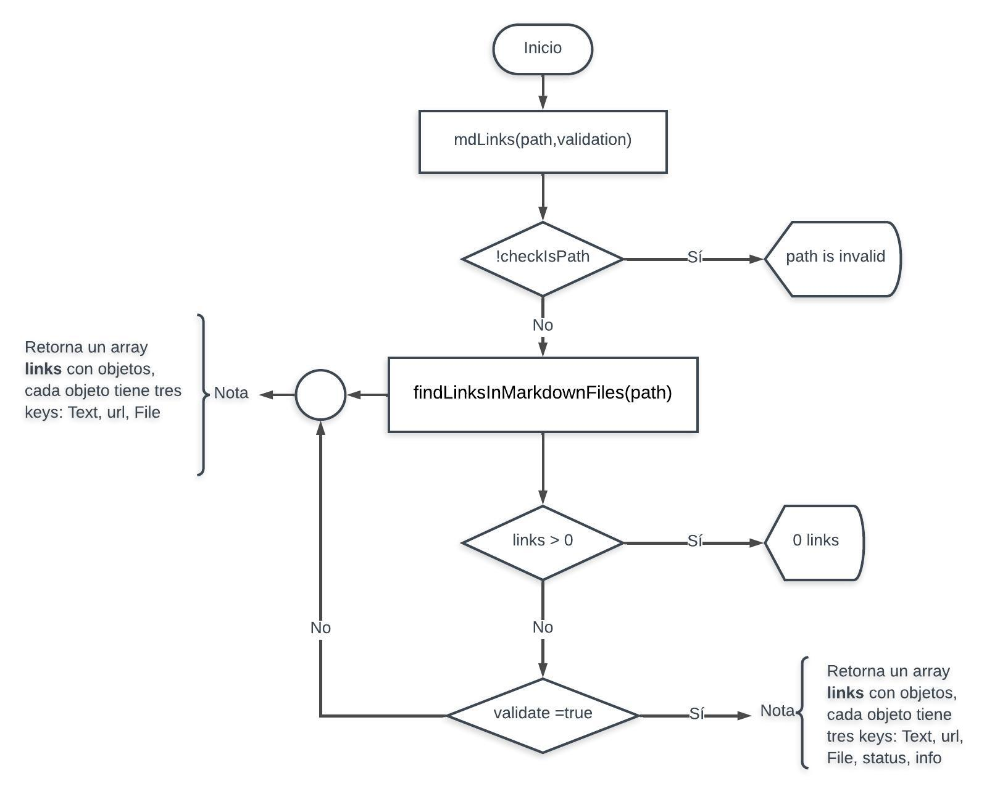

## Función findLinksInMarkdownFiles

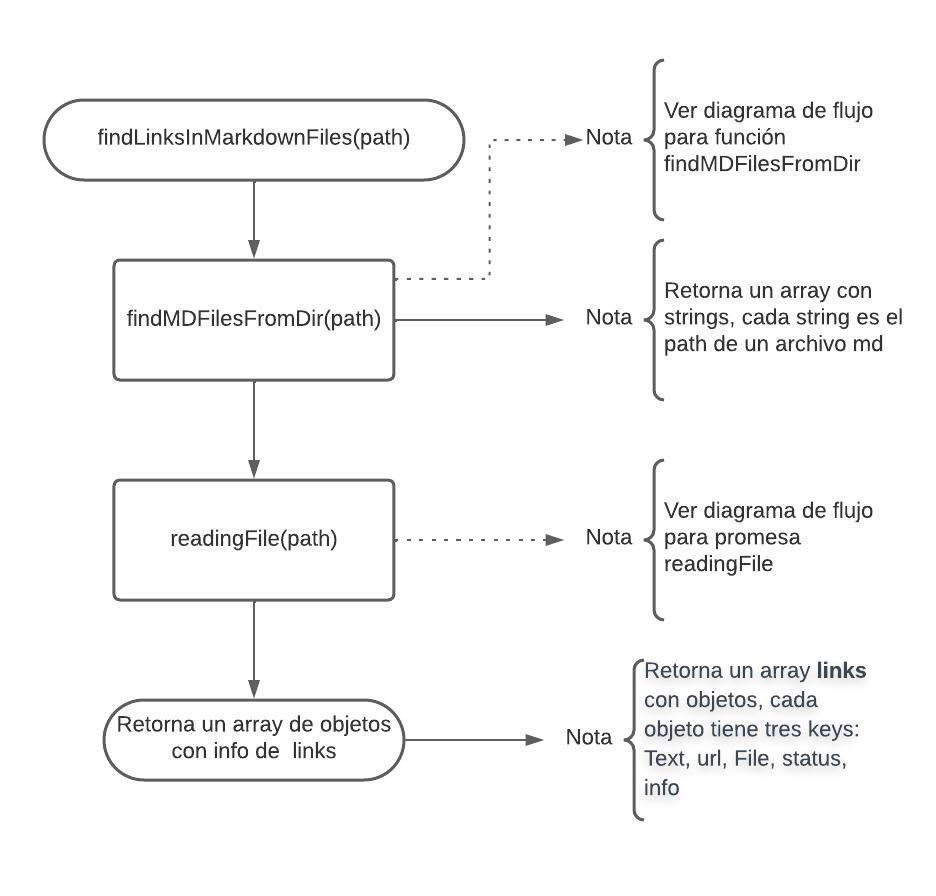

## Función findMDFilesFromDir

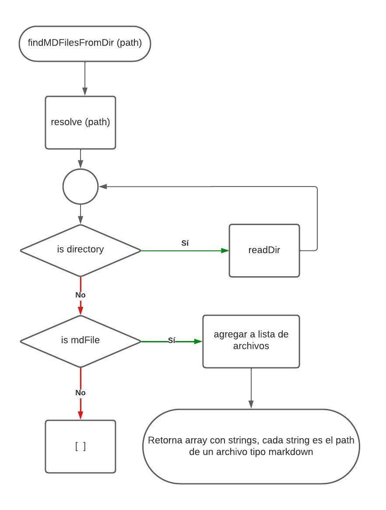

## Promesa readingFile

.jpeg>)

## Función searchingLinks

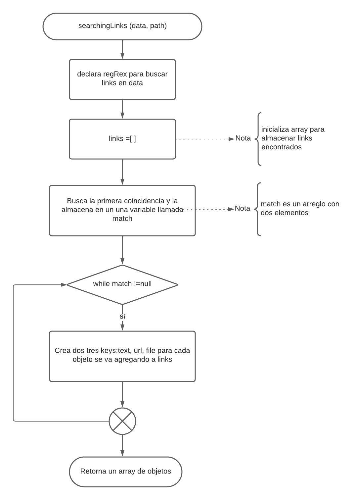

# Tutorial de uso

El ejecutable de esta aplicación se puede correr de la siguiente manera en cualquier terminal:
md-links path [options]
El usuario tiene las siguientes opciones:

## md-links
Si el usuario solamente escribe el nombre de la plicación recibirá un mensaje indicándole que puede invocar un menú de ayuda:

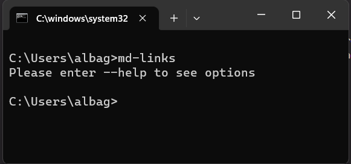

## md-links --help
Agregando la opcón --help se imprimen en pantalla las diferentes opciones disponibles así como los resultados esperados según cada opción:

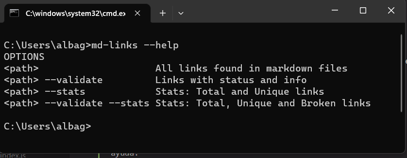

## md-links path
Al dar una ruta se pueden presentar diferentes situaciones:
 - Que el path corresponda directamente a un archivo tipo markdown; en este caso la aplicación lee el archivo y extrae  los links. En pantalla se imprimirá el listado de los links encontrados con su información básica. En el siguiente ejemplo escibimos el nombre del archivo test2.md y obtenemos el siguiente resultado:

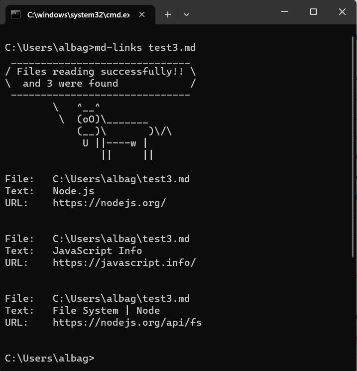

  - Que el path corresponda a un directorio el cual a su vez puede contener otros directorios y/o directamnete archivos markdown. En este caso la aplicación cuenta con un algoritmo recursivo que se encarga de buscar todos los archivos markdown que se encuentren en directorios  y carpetas; por ejemplo podemos tener el siguiente esquema de directorio:

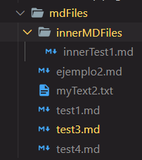

  En este caso podríamos escribir la siguiente linea de comando y obtener estos resultados:

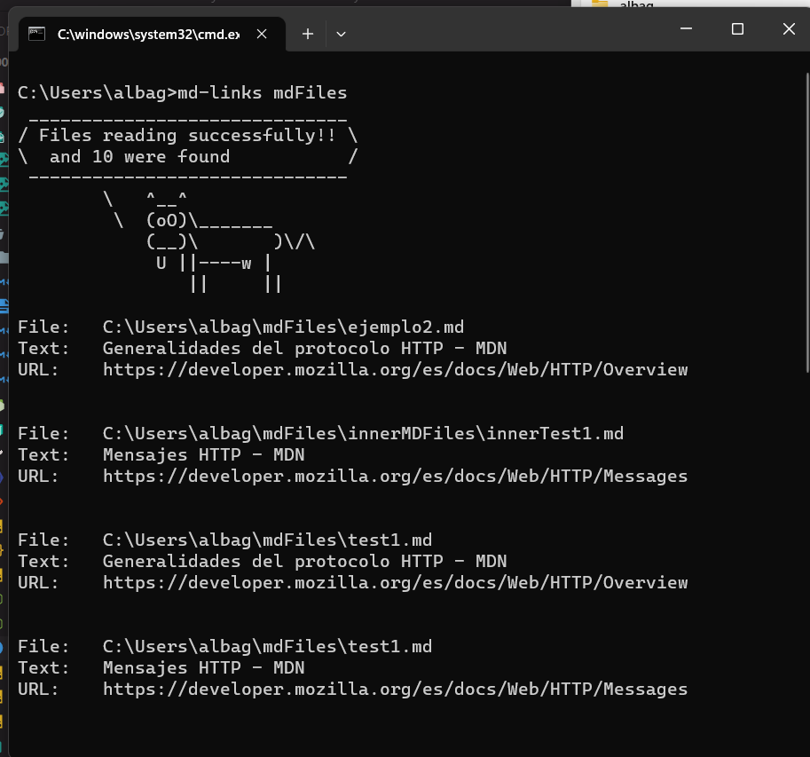

En la captura de pantalla no se alcanzan a ver todos los links encontrados, pero el listado corresponde a todods los links encontrados en carpetas y subcarpetas.

## md-links path --validate

En este caso digitamos el nombre de nuestra librería una ruta y la opción --validate. De acuerdo al contenido del archivo se obtiene el siguiente resultado:

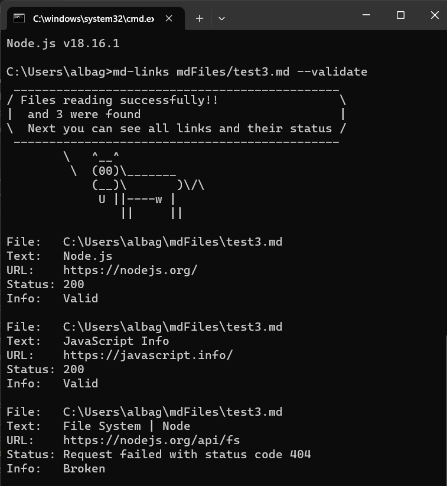

## md-links path --validate --stats
La captura de pantalla muestras los resultados cuando se aplican las dos opciones:

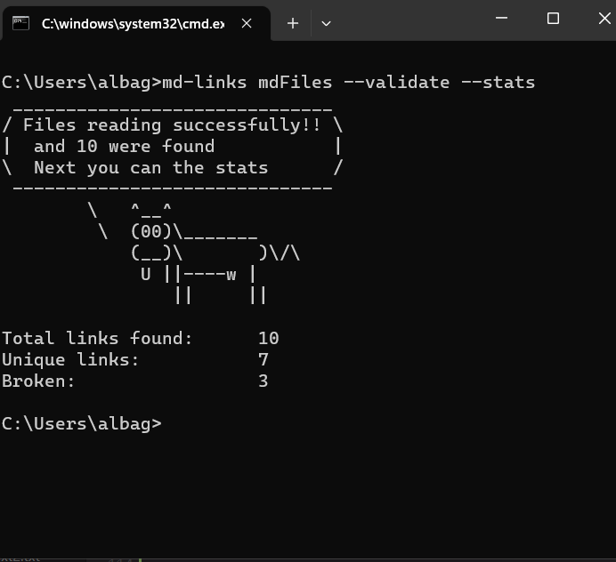

## md-links path --stats

Cuando solo se digita la opción de stats:

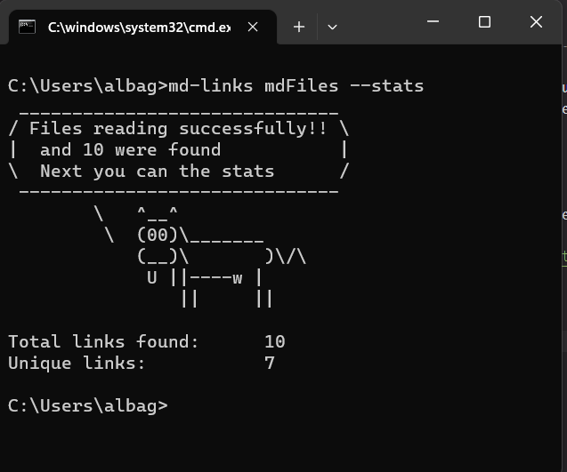

# Contribuidora

Alba Nubia Giraldo Molina

